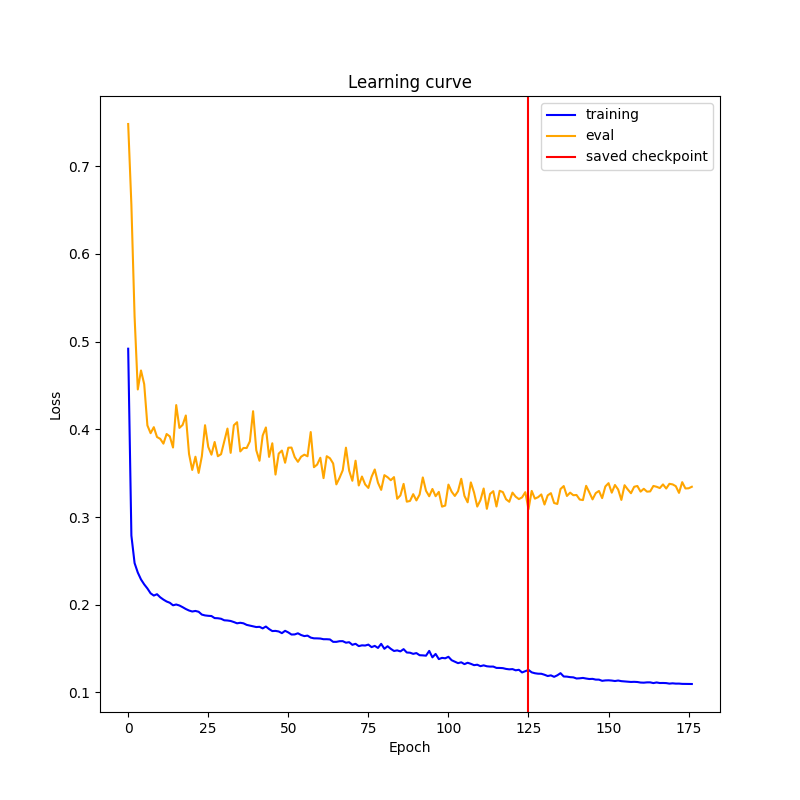
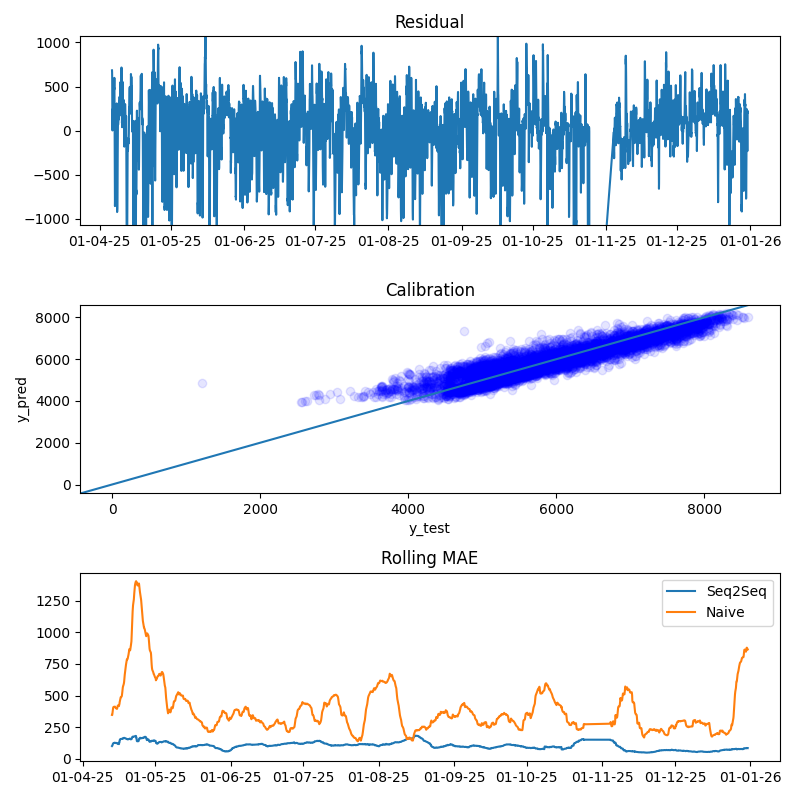
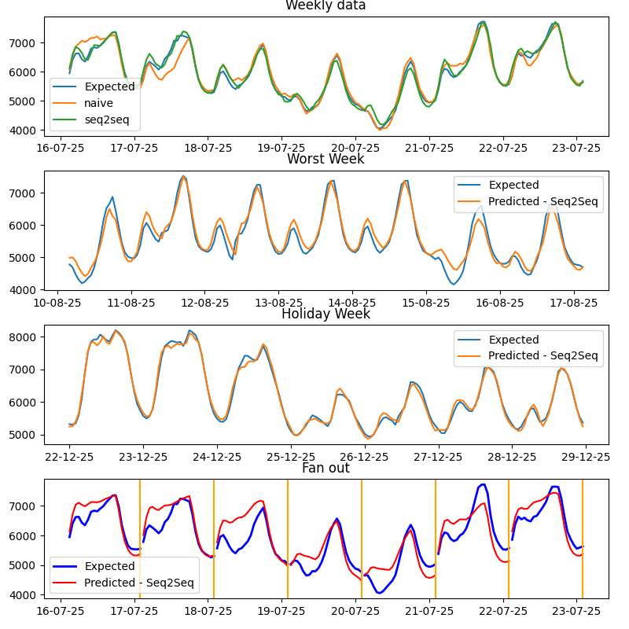

# Energy Demand Forecasting

This project performs a multi-step forecast of Romania's energy demand, predicting the next 24 hours of load. The primary model is a Seq2Seq network. The goal of the project was to put the LSTM architecture into practice. To get a fair comparison, I added several baselines: a standalone LSTM, an XGBoost regressor, and a naive seasonal model. The dataset was fetched from https://www.entsoe.eu/data/power-stats/ with a custom `data_fetcher` that pulls hourly data from 2019 to 2025. It is enhanced with hourly weather data for Bucharest, Romania's largest city, whose temperature is a good proxy for nationwide energy consumption.

### Table of Contents

* [Introduction](#introduction)
* [Features](#features)
* [Project Structure](#project-structure)
* [Getting Started](#getting-started)
* [Usage](#usage)
* [Configuration](#configuration)
* [Model Performance](#model-performance)


### Introduction

The task is a multi-step forecast of the next 24 hours of Romania's energy demand, trained on the 2019–2025 interval from ENTSO-E. The exploratory data analysis showed temperature to be a strong external predictor of consumption, so it was added as a feature. The sequence models (Seq2Seq and LSTM) use a lookback of 168h (one week) and a forecast horizon of 24h. To evaluate them fairly, I established baselines with a naive model and a tree model; the naive baseline uses a weekly seasonal lag (m = 168h).

### Features

Four model families are used: LSTM, Seq2Seq with teacher forcing, XGBoost, and a naive seasonal baseline. Each model is configured through its own YAML file (`lstm.yaml`, `seq2seq.yaml`, `xgboost.yaml`); change the hyperparameters there. Reproducible seeds are set to keep runs deterministic.

For the sequence models, the focus of this project, I added early stopping, a cosine learning-rate schedule, and gradient clipping for training stability. Both models also produce `learning_curve` plots under the `outputs` directory, with the best saved checkpoint marked by a red line:



Evaluation runs across all trained models at once, producing comparison plots that are also saved under the `outputs` directory.

Unit tests covering data processing, baseline model construction, and other small, testable functions live under `tests/`. They run on every push and pull request via the workflow in `.github/workflows`.

The original power-statistics data had only two meaningful columns, `DateUTC` and `Value`. Guided by the EDA, `data_processing` derives the following features:


| #   | Column  | Non-Null Count      | Dtype  
|---------|--------|--------------|----------------|
| 0 | Value  | 61277 non-null |     float64      | 
| 1 | temperature_2m  | 61277 non-null |     float64      | 
| 2 | hour_sin  | 61277 non-null |     float64      | 
| 3 | hour_cos  | 61277 non-null |     float64      | 
| 4 | day_sin  | 61277 non-null |     float64      | 
| 5 | day_cos  | 61277 non-null |     float64      | 
| 6 | month_sin  | 61277 non-null |     float64      | 
| 7 | month_cos  | 61277 non-null |     float64      | 
| 8 | is_weekend  | 61277 non-null |     int64      | 
| 9 | is_holiday  | 61277 non-null |     int64      |


### Project Structure

The project is organized as follows:
```
.
├── CLAUDE.md
├── README.md
├── config
│   ├── base.yaml
│   ├── lstm.yaml
│   ├── seq2seq.yaml
│   └── xgboost.yaml
├── data
│   ├── processed
│   │   ├── RO_power_statistic.csv
│   │   └── RO_temperature_statistic.csv
│   ├── raw
│   ├── xgboost_X_test.csv
│   ├── xgboost_segments.joblib
│   └── xgboost_y_test.csv
├── models
│   ├── lstm.pt
│   ├── scaler.joblib
│   ├── seq2seq.pt
│   ├── target_scaler.joblib
│   ├── test_data.joblib
│   ├── xgboost.joblib
│   └── xgboost_test_data.joblib
├── notebooks
│   └── 01_Exploratory_Data_Analysis.ipynb
├── outputs
│   ├── evaluation_overall.png
│   ├── evaluation_overall_1h.png
│   ├── evaluation_overall_24h.png
│   ├── evaluation_overall_lstm.png
│   ├── evaluation_weekly.png
│   ├── evaluation_weekly_1h.png
│   ├── evaluation_weekly_24h.png
│   ├── evaluation_weekly_lstm.png
│   ├── learning_curve_1h.png
│   ├── learning_curve_lstm_24h.png
│   └── learning_curve_seq2seq_24h.png
├── requirements.txt
├── src
│   ├── __init__.py
│   ├── baselines.py
│   ├── data_fetcher.py
│   ├── data_processing.py
│   ├── evaluate.py
│   ├── model.py
│   ├── seq2seq.py
│   ├── train.py
│   └── utils.py
└── tests
    ├── __init__.py
    ├── conftest.py
    ├── test_baselines.py
    ├── test_data_processing.py
    ├── test_evaluate.py
    └── test_utils.py

```

* `config` contains YAML files for configuring the models and data paths
* `data` where the raw and processed data is stored
* `models` where the trained models are stored
* `notebooks` contains Jupyter Notebook for EDA
* `src` Python source for data processing, training, and evaluation
* `tests` unit tests for data processing, baselines, evaluation, and utilities
* `requirements.txt` required packages for this project

### Getting Started

In order to get this up and running please do the following:

#### Pre-requisites:

* Python 3.10
* pip

1. Clone the repo
    `git clone https://github.com/RaresPopa22/EnergyDemandForecasting`
2. Create and activate a virtual environment (so `python` resolves to the project interpreter)
    `python3 -m venv .venv && source .venv/bin/activate`
3. Install Python packages
    `pip install -r requirements.txt`
4. Download the datasets
    `python -m src.data_fetcher --type energy`
    `python -m src.data_fetcher --type temp`

### Usage

You can either train the models yourself or use the saved models, then evaluate their performance with the scripts in the `src/` directory.

#### Training the Models

In order to train a model, run the `train.py` script with the desired configuration:

* Train Seq2Seq with early stopping and teacher forcing:
    `python -m src.train --config config/seq2seq.yaml`
* Train LSTM with early stopping:
    `python -m src.train --config config/lstm.yaml`
* Train XGBoost:
    `python -m src.train --config config/xgboost.yaml`

#### Evaluating the models

After training, you can evaluate and compare the models using the evaluate.py script:
    `python -m src.evaluate --configs config/lstm.yaml config/seq2seq.yaml config/xgboost.yaml`

This prints regression metrics for each model and generates two plots for the Seq2Seq model: an overall test-set plot (with residual, calibration, and rolling-MAE panels) and a weekly plot (with weekly data, worst week, holiday week, and fan-out panels).


### Configuration

This project uses YAML files for configuration, making it easy to manage model parameters and data paths.

* `base.yaml` contains the base configuration, including data paths
* `seq2seq.yaml`, `lstm.yaml` and `xgboost.yaml` contain model-specific parameters, merged on top of `base.yaml` at load time

### Model Performance

To get an honest estimate of performance, 15% of the data was held out as a test set and never seen during training, so the metrics below reflect behavior on unseen data.

The table below summarizes the performance of the trained models:

| Model   | RMSE error (MWh)  | MAE(MWh)      | MAPE(%) | R2 | Skill score for 1h | Skill score for 24h |
|---------|--------|--------------|----------------|------|-------------------|------------------|
|  seq2seq  |  387.949 |    288.804   | 5.169 | 0.842 | 0.511 | 0.386 |
|  naive  |  584.055 |    390.208   | 6.931 | 0.642 | -0.929 | 0.063 |
|  lstm  |  410.433 |    290.593   | 5.275 | 0.823 | 0.300 | 0.400 |
|  xgboost  |  351.216 |    233.067   | 4.295 | 0.870 | 0.372 | 0.425 |

The skill score is defined as `1 − (model RMSE / persistence RMSE)`, where the persistence baseline simply predicts the value from one step earlier (1h) or 24 hours earlier (24h). A score of 1.0 is perfect, 0 ties the persistence baseline, and a negative value is worse than it, which is why the naive model scores negatively at 1h, where naive 1-hour persistence is very hard to beat.

By skill score, Seq2Seq has a slight edge at the 1h horizon, but at the full 24h horizon XGBoost wins. XGBoost is also the clear winner on RMSE, MAE, and MAPE. Both sequence models comfortably beat the naive baseline.

For the Seq2Seq model, the residuals show no obvious pattern, which suggests the model captured the underlying structure of the data. The calibration panel shows a tendency to overestimate. The rolling-MAE panel shows the model staying below the naive seasonal baseline.



In the weekly plot, the fan-out panel is the real story: error grows with the forecast horizon, small in the early steps, widest mid-horizon, then recovering somewhat toward the end.

